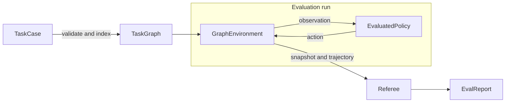
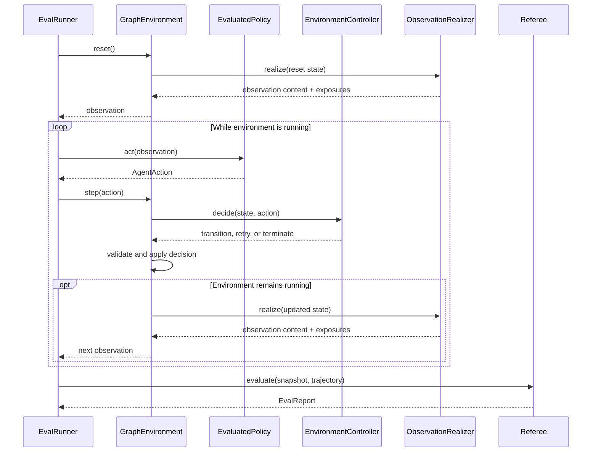
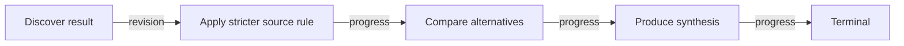
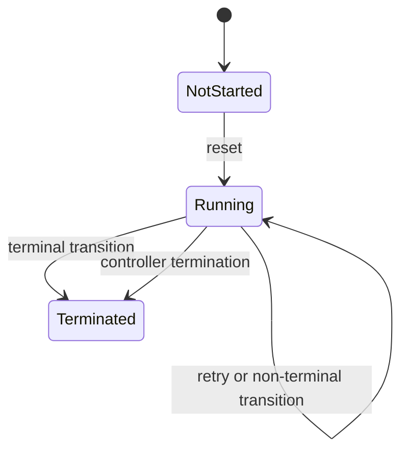

# Canary Agent Evaluation Framework

`canary-agent-eval` evaluates an agent through a controlled multi-turn
interaction. A host defines the task, the environment behavior, and the scoring
rules. The crate supplies the typed execution contracts, deterministic graph
state, factual trajectory, and runner.

The framework borrows the vocabulary of reinforcement learning where it makes
the responsibilities clearer:

- the **environment** owns task state and produces observations;
- the **evaluated policy** receives an observation and returns an action;
- the **runner** repeatedly connects those two sides;
- the **referee** evaluates the completed trajectory.

This is an evaluation runtime, not an RL training framework. It does not learn
a policy, calculate a reward after every step, or explore the task graph. The
current implementation provides the interaction boundary while leaving task
semantics and scoring to injected components.

## Core Model



The components have deliberately different authority:

| Component | Responsibility | Does not own |
| --- | --- | --- |
| `EvalEnvironment` | Task state, transitions, observations, trajectory | Agent implementation or final scoring |
| `EvaluatedPolicy` | Produce an `AgentAction` from an observation | Graph progression |
| `EnvironmentController` | Interpret the latest action and choose a typed decision | Direct state mutation or user-message wording |
| `ObservationRealizer` | Turn environment state into the next user-facing observation | Transition selection |
| `EvalRunner` | Coordinate the environment, policy, and referee | Task semantics |
| `Referee` | Score the final snapshot and factual trajectory | Runtime state transitions |

The tested agent is best understood as an external policy or I/O device. It
does not inspect or mutate the task graph. It sees only the observation emitted
by the environment and returns the action that the environment will evaluate.

## Interaction Loop

`EvalRunner` implements the following structural loop:

```text
environment.reset()
while environment is running:
    action = policy.act(observation)
    output = environment.step(action)
referee.evaluate(snapshot, trajectory)
```

For `GraphEnvironment`, one step expands to:



This loop is operationally closed: every policy action returns to the
environment and may produce another observation. It is not yet a fully
specified RL-style semantic loop. In particular, obligations are opaque data,
the controller decides whether they were met, and only the final referee emits
scores. Strengthening that semantic closure is future work; it should not be
hidden behind RL terminology in the current API.

`EvalRunnerConfig::max_environment_steps` bounds an evaluation that repeatedly
retries or otherwise fails to terminate.

## Authoring A Task

### Task Case And Graph

`TaskCase` is the authored representation. It contains:

- a case ID and version;
- the start node;
- a list of task nodes;
- directed transitions between nodes.

`TaskCase::compile()` validates the authored case and creates an immutable,
indexed `TaskGraph`. Compilation checks structural invariants such as unique
IDs, valid transition endpoints, a valid start node, and known replacement
targets.



The graph defines allowed interaction order. It does not interpret business
payloads or search for a path. The environment controller must select a
transition whose source is the current node.

### Constraints

A constraint is a persistent rule that applies to subsequent policy behavior.
Examples include a budget, an allowed source set, or a required output format.
Constraints accumulate along the selected graph path unless explicitly
replaced or removed.

Each node contains zero or more `ConstraintDelta` values. The supported
operations are:

| Operation | Precondition | Effect |
| --- | --- | --- |
| `Add` | The ID is not active | Add a new active constraint |
| `Replace` | The target ID is active | Remove the target and add a new constraint |
| `Remove` | The target ID is active | Remove the active constraint |

`ConstraintLedger.active` is the current effective set.
`ConstraintLedger.applied` is the ordered factual history of accepted deltas.
Invalid operations fail atomically instead of partially changing the state.

Constraint payloads are `serde_json::Value`. The core does not infer that two
payloads conflict, imply one another, or describe the same business concept.
Those meanings belong to the case author and environment controller.

### Obligations

An obligation is a node-local completion criterion. It describes what the
current action must accomplish before the controller should advance the graph.
A node may define:

- a `result_obligation` for the required answer or artifact;
- an `evidence_obligation` for supporting evidence.

Constraints and obligations are intentionally separate:

```text
constraint: "Use only official sources from now on."
obligation: "Give the release version and exact release date in this step."
```

The current crate stores obligation payloads but does not evaluate them. An
`EnvironmentController` may use an LLM, deterministic rules, or a hybrid
implementation to decide whether the latest action satisfies them.

Natural-language instructions are not automatically constraints or
obligations. A phrase such as `introduce family F0` is ambiguous until the case
author states whether it changes persistent acceptance rules, defines a
completion criterion, or is merely observation wording. The runtime should not
guess that meaning.

## Environment State

`GraphEnvironment` is the supplied graph-backed implementation of
`EvalEnvironment`. It owns:

- the immutable `TaskGraph`;
- the current `EnvironmentState`;
- the `EnvironmentController`;
- the `ObservationRealizer`;
- an append-only list of `EnvironmentEvent` values.

The environment status is intentionally small:



There is no separate human-input state. During an evaluation, all user-facing
messages are observations generated by the environment.

### Decisions

After each `AgentAction`, the controller returns one `EnvironmentDecision`:

- `Transition`: advance through a named outgoing transition and attach
  evidence;
- `Retry`: keep the current node and ask the policy to try the same step again;
- `Terminate`: stop the evaluation with a controller-provided reason.

The controller proposes a decision; `GraphEnvironment` remains the state
authority. It validates and applies the decision and rolls back a failed node
application.

### Observations

The observation realizer receives the graph, current state, latest action, and
an `ObservationCause`:

- `Reset` for the first observation;
- `Transition` after graph advancement;
- `Retry` after the controller rejects an action.

It returns `ObservationContent` containing natural-language user text,
constraint exposures, and opaque metadata. The environment turns that content
into an `EnvironmentObservation` for the policy.

This split keeps two decisions independent:

```text
EnvironmentController  -> what happens next?
ObservationRealizer    -> what does the policy observe next?
```

## Exposure And Monotonic Knowledge

The environment may contain active constraints that have not yet been shown to
the evaluated policy. `ExposureLedger` records which active constraints have
entered the policy's knowledge and why.

The observation realizer may declare that an observation exposes a constraint
through:

- `Disclose`: the user text explicitly communicates it;
- `Derive`: it follows from already exposed inputs under a named rule;
- `ProvideContext`: the environment supplies it from a named external context.

The corresponding factual origins are stored as `ExposureOrigin` values:
`ExplicitDisclosure`, `EnvironmentDerived`, and `ContextProvided`.

These declarations are trusted semantic input. The core validates referenced
constraint IDs and derivation dependencies, but it does not inspect the user
text to prove that a disclosure was actually communicated or that a derivation
is logically sound.

Knowledge is monotonic at the ledger level: an active constraint can be
exposed once, and its exposure record is retained. Derived exposure requires
all declared inputs to be active and already exposed. A replacement constraint
does not inherit exposure from the constraint it replaces; it must be exposed
explicitly in a later observation.

The policy-visible state is calculated as:

```text
active constraints intersect exposed constraint IDs
```

Observation emission and its exposure records are one logical operation. The
environment validates every requested exposure before updating the ledger or
recording `ObservationEmitted`, so an invalid exposure cannot leave partial
knowledge behind.

`RuntimeAgentPolicy` includes this visible state in the model-facing input as
authoritative active constraints. A custom `EvaluatedPolicy` receives the same
structured `EnvironmentObservation` and may render it differently.

## Factual Trajectory

The environment records what happened as ordered `EnvironmentEvent` values:

- environment start;
- observation and exposure emission;
- agent action recording;
- controller decision;
- applied transition and evidence;
- termination;
- optional custom events.

The event sequence is factual rather than inferred. `snapshot()` returns the
current environment state; `trajectory()` returns the ordered history used by
the referee and external analysis.

`AgentAction` preserves more than final assistant text. The runtime adapter can
record function requests, starts, completions, failures, runtime messages, and
token usage. This allows metrics to evaluate the execution path as well as the
final answer.

The current trajectory is in memory. Durable storage and replay are outside
the present implementation.

## Agent Roles

The common LLM-backed setup uses three isolated agent instances:

```text
evaluated-policy agent
  business tools such as web_search

environment-controller agent
  environment_decision only

referee agent
  normally no tools
```

`RuntimeAgentPolicy` adapts a `canary-agent-runtime::Agent` to `EvaluatedPolicy`.
The other two roles are host-defined implementations of `EnvironmentController`
and `Referee`; the example uses separate runtime agents for both.

Keeping registries role-specific prevents the evaluated policy from seeing
evaluation-control functions and prevents the controller from invoking
business tools on the policy's behalf.

### Typed Environment Decisions

`EnvironmentDecisionTool` lets an LLM-backed controller submit one typed
decision through `EnvironmentDecisionSink`. The supported variants mirror
`EnvironmentDecision`:

```json
{
  "kind": "transition",
  "transition": "request_final_synthesis",
  "evidence": [
    {
      "kind": "url",
      "reference": "https://example.com/source"
    }
  ],
  "reason": "The current obligations were satisfied."
}
```

The sink rejects conflicting decisions in one controller turn. The tool does
not mutate environment state; `GraphEnvironment` takes the submitted decision
and performs validation and transition application.

## Referee And Metrics

After termination, the referee receives:

- the final `EnvironmentSnapshot`;
- the complete environment trajectory.

`EvalMetric` is the deterministic scoring extension point. Each metric returns
a `MetricResult` with a name, score, optional pass/fail value, and arbitrary
details. A host may instead implement an LLM referee or combine deterministic
metrics with a qualitative assessment.

The referee can score factual correctness, evidence quality, policy adherence,
tool use, retries, latency, or any domain-defined property. It observes the
run; it does not repair environment decisions or alter the trajectory.

## Example

`examples/eval` demonstrates a multi-stage research evaluation:

1. identify the latest stable Rust release;
2. revise the source constraint to official Rust sources;
3. compare the previous release;
4. produce a constrained final synthesis.

The tested policy receives `web_search`, the environment controller receives
`environment_decision`, and the referee receives no tools.

```bash
export CANARY_AGENT_MODEL=your-model
export CANARY_AGENT_API_KEY=your-model-key
export CANARY_AGENT_BASE_URL=https://api.openai.com/v1
export EXA_API_KEY=your-exa-key

cargo run -p canary-agent-eval-example
```

## Extension Points

The business-agnostic interfaces are:

- `TaskCase` and opaque JSON payloads for authored task semantics;
- `EvalEnvironment` for environments not represented by a task graph;
- `EnvironmentController` for action interpretation and progression policy;
- `ObservationRealizer` for simulated-user communication;
- `EvaluatedPolicy` for runtime agents or deterministic test doubles;
- `Referee` and `EvalMetric` for scoring.

## Current Boundary

The crate currently guarantees a typed environment-policy interaction,
validated graph updates, monotonic exposure records, and a factual trajectory.
It intentionally does not provide:

- policy training or optimization;
- per-step reward calculation;
- automatic obligation evaluation;
- semantic constraint conflict detection;
- graph search or automatic transition selection;
- durable environment persistence or replay;
- distributed evaluation scheduling.

The next design discussion should focus on **semantic loop closure**: what
typed evaluation result the environment should derive from an action before a
transition is permitted, how that result relates to obligations, and whether
intermediate reward or feedback belongs in the core. That work should preserve
the current authority boundary: the policy produces actions, the environment
owns state transitions, and the referee evaluates the completed trajectory.
