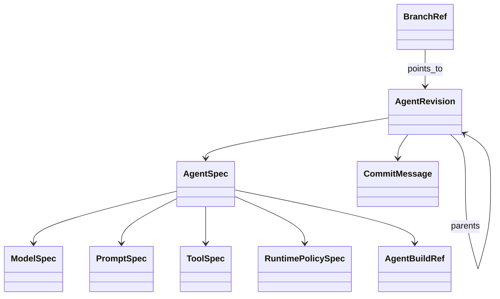
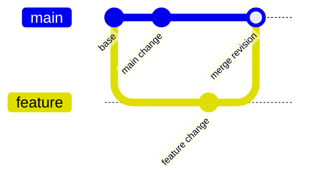

# Agent Revision Model

## Motivation

An agent can change without a corresponding application release. Prompts,
model settings, visible tools, tool schemas, and runtime policies may be
adjusted repeatedly while evaluating an agent.

Git remains useful for source code, but source commits alone do not provide a
clear history of these agent configuration changes. Several agent revisions
may be explored between application commits, and one application build may
contain many different agent specifications.

`canary-agent-revision` provides a small Git-like history for declared agent
specifications. It makes configuration changes reviewable, branchable, and
reproducible as metadata.

## Core Model

### AgentSpec

`AgentSpec` is the revisioned declarative description of an agent. It contains:

- model identity and settings
- system prompts and prompt templates
- model-visible tool interfaces, including input and output schemas
- runtime policy references
- an optional opaque `AgentBuildRef`

The specification contains tool contracts, not tool implementations. A tool
is represented by its name, description, parameters, output schema, and
configuration. The implementation remains owned by the application.

`AgentBuildRef` is an application-defined identifier for the build that
provides the runtime and compiled dependencies. The SDK does not interpret its
format. It may represent a Git commit, release, image digest, CI build, or any
other identifier meaningful to the application.

### AgentRevision

An `AgentRevision` is an immutable snapshot of an `AgentSpec` plus:

- a content-derived revision ID
- zero or more parent revision IDs
- a commit message
- optional metadata such as author and creation time

The revision ID is derived from the agent ID, specification digest, parents,
commit message, and metadata. Changing any of these creates a different
revision.

### Branches

A `BranchRef` names a mutable pointer to a revision for one agent. A branch
allows independent lines of agent configuration to be explored without
changing another branch.

The controller supports:

- committing a new revision on a branch
- creating a branch from an existing branch
- checking out the branch head
- loading a revision by ID
- inspecting first-parent history with `log`
- comparing two revisions with `diff`
- merging branches

`log` returns the branch history newest first through the first-parent chain.
This is the branch-oriented equivalent of `git log --first-parent`.

## Merge Semantics

Merging is a three-way merge using a common ancestor:

For a clean merge, the controller creates a new immutable revision with two
parents and advances the target branch. The merge commit records the supplied
commit message.

When both branches change the same specification field differently, the
controller reports a merge conflict and leaves the target branch unchanged.
The controller does not silently choose a side.

## Persistence

`RevisionStore` is the storage boundary. The repository includes a local JSON
store for development and embedding. The store persists revision objects and
branch references and exposes compare-and-set branch updates.

The store is responsible for persistence and concurrency of revision data. It
does not execute agents or resolve application dependencies.

## Deliberate Boundaries

The revision crate does not:

- execute an agent or call a model
- construct runtime agents from a specification
- serialize or relocate tool implementations
- inspect Git repositories or require a clean worktree
- resolve Cargo dependencies or application artifacts
- decide whether a build is compatible with a specification
- evaluate runtime behavior, quality, cost, or safety
- store conversation threads, turns, or tool outputs

An application integrates the revision controller with its own factory and
dependency registry. The factory supplies the actual model client, tool
implementations, runtime policies, and other dependencies when using a
committed specification. The application also decides how to interpret
`AgentBuildRef` and whether the current executable is compatible with it.

## Relationship To Evaluation

Revision and evaluation answer different questions:

- revision: what declared agent configuration changed?
- evaluation: how did an agent behave on a task?

Evaluation may compare revisions, but evaluation results and behavioral metrics
are not part of the revision object. This keeps revision control a static
tracking mechanism and leaves behavior assessment to the evaluation layer.
