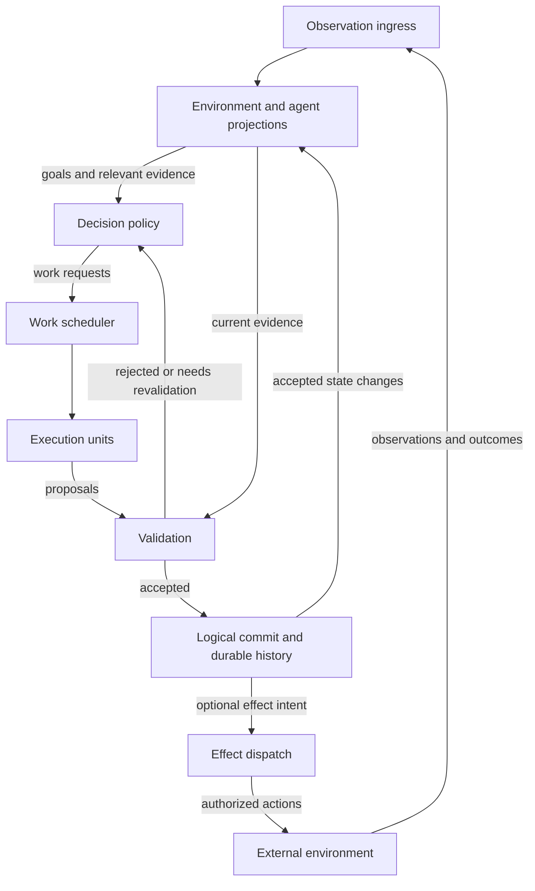

# Concurrent Agent Runtime

## Status

This document describes a target architecture for extending Canary from a
turn-oriented agent runtime into a runtime that can also operate in concurrent,
independently changing environments. It is a design direction, not a statement
that every type or API described here already exists. Its purpose is to establish
responsibilities, relationships, and correctness boundaries; detailed APIs and
state transitions will follow in a separate design.

## Motivation

The current Canary runtime fits a common digital-agent interaction:

```text
user input -> model -> function calls -> model -> final response
```

The thread is durable, one turn owns execution, and another request cannot
concurrently advance the same session. This is a useful consistency model for
chat, question answering, and many code-agent workflows because the relevant
environment is often stable while the model reasons.

A physical agent cannot make that assumption. Cameras, microphones, humans,
other machines, and physics continue changing the environment while models and
tools execute. A result produced from state `S` may arrive after the environment
has advanced to `S'`.

Concurrency is therefore part of the meaning of execution, rather than only a
performance optimization. The runtime must know what a computation depended
on, determine whether its result is still valid, and commit or discard it
accordingly.

This requirement is not limited to robots. Browsers, production services,
collaborative documents, and remote systems also evolve independently. A
single-channel, user-driven agent is the simplest case of this more general
model.

The target is a general-purpose agent runtime: applications can choose sources,
decision policies, execution units, and consistency requirements. Existing
user-driven applications must remain expressible within the same architecture.

## Core Principle

The model is an execution unit; the agent runtime is the machine.

The runtime coordinates models, perception pipelines, local policies, and
functions with different latency and execution characteristics. Some return a
single result; others stream proposals or report progress over a long period.
Applications supply these units and define their capabilities.

Device and safety controllers may run independently of Canary. Canary exchanges
intent and observations with them; their control loops and timing guarantees
remain owned by the controllers.

Three principles guide the design:

- Committed facts are durable and distinguishable from beliefs and intentions.
- Work is bound to explicit assumptions about its inputs and purpose.
- External effects require current authority at the resource boundary.

## Runtime Shape



The logical execution path is:

```text
observe -> project -> decide -> issue -> execute -> validate -> commit
             ^                                                  |
             +-------------- accepted state changes -------------+
```

When a commit includes an effect intent, dispatch and observed outcomes close
the external feedback path. Committing an intent does not establish that the
environment changed. Rejected proposals return to policy for a decision about
what, if anything, should happen next.

## Goals And Work Creation

A decision policy determines what deserves attention and what work to request.
It considers active goals, relevant observations, accepted results, and pending
work. A rule, model, or combination of both can implement this policy. The
scheduler determines when admitted work runs and which resources it can use.

Work can originate from a user message, timer, external event, ongoing goal, or
an earlier result. An observation does not automatically invoke a model. For
example, a monitoring agent may observe continuously and request reasoning only
when an application-defined condition changes.

Goals provide continuity across these triggers. The application defines how
goals are introduced, revised, completed, or withdrawn. Work records the intent
it serves so that a changed request can supersede old work even when its data
dependencies remain unchanged. Goal changes are accepted agent-state changes;
model suggestions do not acquire authority merely by being generated.

A decision policy may itself use a slow execution unit. Its proposals are
subject to the same validation as other work. Canary coordinates the lifecycle;
the application supplies the meaning of goals and the decisions that advance them.

## Two Planes

The runtime separates durable agent state from rapidly changing live state.

### Durable coordination plane

This plane records the authoritative history needed for restart and coordination:

- goals and tasks
- accepted observations when durability is required
- issued work and its dependencies
- accepted decisions and committed effect intents
- observed effect outcomes, including unresolved outcomes
- suspensions, failures, cancellation, and recovery
- human interaction history

The existing append-only thread and turn-item model belongs primarily to this
plane. It remains useful as a factual journal and recovery source.

### Live execution plane

The execution plane coordinates current activity:

- high-rate observations
- in-memory projections and caches
- runnable and in-flight work
- priorities and scheduling classes
- dependency invalidation
- cancellation and replay
- connections to models, policies, functions, and controllers

Applications decide which source observations need persistence. Accepted
decisions, effect intents, and observed effect outcomes must survive restart.
Recovering them reconstructs what was recorded; it does not imply that an
external action can be replayed safely or that all historical sensor data exists.

## Observations And Projections

An observation is a factual report from one source. It is not automatically a
globally consistent snapshot of the world.

An observation identifies its source, source-local order, observation time, and
content. Content may be structured data or a reference to audio, images, or
other media; high-rate data need not be copied into a conversation journal.

Each source owns its sequence. Timestamps help correlate data but do not create
a perfect global ordering. Causal relationships should be represented
explicitly when they matter.

Projections derive useful state from observations. A projection is a runtime
view or belief about the environment, not the physical world itself. It may be
partial, delayed, or uncertain.

The factual record is that a source reported something. A perception result or
model interpretation retains its source and uncertainty rather than becoming
an unquestioned fact about the environment.

An execution unit receives a selected view appropriate to its task and scope.
Applications define context selection, summarization, and modality handling.
The dependencies associated with that view must remain attached to the work;
the runtime cannot discover a complete semantic read set from model text alone.

## Scopes And Shared Resources

An application defines which observations, goals, projections, and work belong
together. Such a scope may represent a conversation, device, workspace, or other
application-defined boundary. Canary does not require user, tenant, or robot
fields in the core model.

Observation routing and context selection must respect these boundaries. Tasks
may share projections or resources when the application grants access. Shared
resources have a common identity across the scopes that use them, so separate
tasks or agent instances cannot independently assume exclusive ownership.

Three questions govern concurrent execution:

| Concern | Question |
| --- | --- |
| Dependency validity | Does the evidence still support this proposal? |
| Resource availability | Can this work use the required capacity or exclusive resource? |
| Effect authority | Is this executor currently allowed to affect that resource? |

A model capacity slot affects scheduling. An exclusive claim coordinates use
of a shared actuator or publication endpoint. An effect fence lets the resource
or its authoritative adapter reject commands from a superseded owner. These
concepts have different responsibilities even when one adapter implements them.

Fencing is effective only where the effect is controlled. An internal token
cannot stop an old executor that the target still accepts. Applications supply
the enforcement mechanism and declare any limits. Transferring authority also
does not undo a command already accepted by the target; ongoing actions may
need an explicit stop or handoff before conflicting work can proceed.

## Work And Dependencies

A work item identifies the requested computation, its owning task and scope,
the execution capability it needs, its inputs, and its validity conditions.
Resource requirements and priority allow the scheduler to admit and coordinate
work. Child work may continue a task after an earlier result is accepted.

Dependencies identify the assumptions read by the work. They should be
semantic and fine-grained:

```text
human_intent @ version 7
object/cup/pose @ version 42
navigation/map @ version 12
```

A global environment revision is insufficient by itself. If an unrelated
camera region changes, a navigation plan should not necessarily be discarded.
Fine-grained dependencies let the runtime invalidate only affected work.

Exact-version matching is one validity rule. A computation may instead depend
on a section hash remaining unchanged or an object remaining within a reachable
region. Applications define these predicates and their supporting evidence;
Canary tracks the dependencies and invokes the appropriate validation policy.

Freshness also depends on observation quality. If a sensor stops reporting,
its last version may remain unchanged while its evidence becomes too old to
use. A validity condition may therefore include evidence age, source health,
or uncertainty. Unknown validity requires an explicit policy decision; it must
not silently be treated as valid.

Validation is relative to available evidence. It does not establish that the
physical world matches a projection, nor freeze the environment until an action
finishes. Conditions that must hold during action execution need enforcement
by the target controller or effect adapter.

## Proposal, Validation, And Commit

An execution result initially proposes a state change, follow-up work, or
external action. It retains the identity and dependencies of the work that
produced it. Receiving the result establishes that it was produced, not that
its claims are true or that its proposed action is authorized.

Before retirement, the runtime checks the proposal against the current
projection and applicable guards. The result is one of:

- `Accept`: the proposal satisfies its validity conditions and guards
- `Reject`: the proposal cannot be accepted, with a reason
- `RevalidationRequired`: additional checking is needed before acceptance

Rejection does not automatically cause replay. Policy may discard the proposal,
request new work, choose a fallback, or seek external input. Revalidation may
use an application-defined check against newer evidence. Any repaired proposal
must itself pass validation.

Acceptance authorizes a logical commit: the accepted decision, relevant
validation evidence, agent-state changes, and any effect intents are recorded
together. Concurrent updates to the state and authority being checked must not
silently invalidate that acceptance before commit. This boundary is local to
the coordinated state; it is not a transaction over the external environment.

Logical commit and external completion are distinct. Work with no external
effect may finish when its result is accepted. An accepted proposal with an
effect produces an intent that is dispatched under current authority. Evidence
about the outcome then returns through observation ingress. Failure to obtain
an outcome leaves an unresolved effect, not proof of success or failure.

An existing function that writes files, calls a payment API, or moves a device
is an effect executor. Its invocation must follow an accepted effect intent;
validating its return value afterward cannot prevent an effect already made.
Functions that mix reasoning and external actions must expose that boundary or
declare the whole invocation effectful. Side-effect-free computation is what
can run speculatively and have its result discarded.

## Streaming And Ongoing Work

Execution units may produce a single result, a stream of proposals, or progress
over an ongoing operation. Work completion and the arrival of an individual
result are therefore separate events at the architectural level.

Internal progress can be observed while computation continues. Output delivered
to a person or external system, including text and speech, is an effect. The
application defines meaningful emission boundaries and whether authority covers
an individual output segment or an ongoing stream with revocation conditions.
The runtime must not expose speculative content as a committed answer by
accident.

New input can supersede ongoing work. For example, a spoken correction may
invalidate an answer while it is being generated. Canary can request
cancellation, revoke future output authority, and discard late proposals from
that work. Already delivered speech or accepted device commands remain part of
the history. Stopping a downstream operation depends on its adapter and may
require acknowledgment or reconciliation.

## Effect Delivery Semantics

Both digital and physical actions can create irreversible external effects. A
database write, payment request, message publication, device command, spoken
response, and physical movement all require explicit execution semantics. The
distinction is not whether an action is digital or physical, but what guarantee
its executor can provide when delivery, execution, or acknowledgment fails.

The proposed model exposes three delivery semantics for effectful work:

```rust
enum EffectDelivery {
    AtMostOnce,
    AtLeastOnce,
    ExactlyOnce,
}
```

| Semantic | Dispatch and recovery policy | Guarantee boundary |
| --- | --- | --- |
| `AtMostOnce` | Avoid redispatch when the earlier attempt may have reached the executor | No repeated invocation for the same command within the declared delivery boundary; execution may be omitted |
| `AtLeastOnce` | Allow redispatch until delivery is confirmed, subject to cancellation and retry policy | Eventual delivery assumes recovery and continued retries; duplicate execution is possible |
| `ExactlyOnce` | Use stable command identity and an executor protocol that atomically deduplicates the effect | One committed effect on successful completion within the executor's declared scope |

`AtMostOnce` is appropriate for non-idempotent actions when duplication is more
dangerous than omission. If acknowledgment is lost, the result may remain
indeterminate and require reconciliation.

`AtLeastOnce` favors eventual delivery over avoiding duplicates. Idempotency or
target-side duplicate handling can make repeated execution acceptable. A command
ID supports correlation but prevents duplicates only if the target enforces it.

`ExactlyOnce` is an end-to-end capability, not a promise the runtime can create
by itself. It requires support from the effect adapter and target system, such
as an atomic transaction that couples durable command-ID deduplication with the
effect and its completion record. When that support is absent, the action must
use `AtMostOnce` or `AtLeastOnce` semantics instead.

Delivery, executor acceptance, and successful action completion are different
observations. None of these modes guarantees success under permanent failure,
cancellation, or exhausted retries. The adapter defines the acknowledgment
meaning and the boundary of its guarantee, including any downstream retries.

Effectful proposals must pass dependency and safety validation before dispatch.
Their durable records should include the command identity, selected delivery
semantic, attempt state, acknowledgment, and reconciliation result. This lets
recovery distinguish work that was never issued from work whose external
outcome is unknown.

Cancellation cannot resolve an unknown outcome. Reconciliation may query the
executor or gather new evidence; when it cannot establish the result, the
effect remains indeterminate and policy determines further action.

Delivery semantics and reversibility are separate properties. An exactly-once
effect may still be irreversible, while an at-least-once effect may have a
compensating action. Idempotency, deduplication, compensation, and transactional
support are capabilities declared by the application or effect adapter; Canary
must not infer them.

## Typical Cases

The following cases exercise the main correctness properties of the model
without requiring a particular scheduler implementation.

### Concurrent independent computation

An application policy requests two independent analyses after a user asks for
summaries of two documents. They execute at the same time:

```text
Work A reads document/A @ 4   -> Summary proposal A
Work B reads document/B @ 12  -> Summary proposal B
```

Neither dependency changes before validation. Both proposals can be accepted
and committed. Their completion order does not need to match their issue order
because they neither depend on nor conflict with each other.

The accepted summaries update task state. Policy can then request a combined
response once both are available. Its dependencies include those accepted
results. This closes the internal feedback loop without serializing the two
independent analyses.

### Dependency invalidation

A task policy requests a grasp plan using an exact-version dependency:

```text
Work A reads object/cup/pose @ 42
    -> a new observation advances object/cup/pose to 43
    -> Work A produces Proposal A
    -> validation rejects the stale dependency
```

The proposal must not commit against the new pose. Validation reports the
invalidation; a later policy decides whether to discard, revalidate, or reissue
the work against version 43. If the goal was withdrawn, policy may simply
discard the result. Unrelated environment changes would not invalidate this
proposal, although evidence age or source failure could independently do so.

### Concurrent conflicting effects

Two proposals can both be fresh while competing for authority over the same
resource:

```text
Work A -> move robot/arm/right to shelf A
Work B -> move robot/arm/right to shelf B
```

Dependency validation alone cannot resolve this conflict. Both proposals need
an exclusive claim on `robot/arm/right`, and the actuator adapter must enforce
the current effect fence when accepting a command. The other proposal must
wait, be rejected, or be reconsidered according to policy. If ownership changes
during motion, the controller must handle stopping or handing off that motion;
rejecting future stale commands does not stop an action already underway.

The same model applies to digital effects such as two valid proposals trying to
publish different revisions of the same document.

### Crash after effect dispatch

An accepted proposal produces a durable effect intent with command identity
`C`. The dispatcher sends `C`, but the runtime crashes before recording an
acknowledgment:

```text
effect intent C committed
    -> C dispatched
    -> runtime crashes
    -> acknowledgment unknown
    -> recovery finds unresolved C
    -> reconciliation queries the executor
    -> outcome recorded, or remains indeterminate
```

Recovery must not infer that the effect failed, succeeded, or was never issued.
The outcome is indeterminate unless the executor or environment can reconcile
it. Cancelling the originating task does not resolve that uncertainty. Whether
`C` may be retried depends on its declared `AtMostOnce`, `AtLeastOnce`, or
`ExactlyOnce` semantics and on capabilities provided by the
effect adapter. A resolved outcome re-enters the task's observations and informs
the next decision. A receipt acknowledgment alone is not proof that the action
completed successfully.

## Safety Boundary

Hard real-time control and safety enforcement remain outside the frontier-model
loop. A slow or unavailable model must not prevent stabilization, collision
avoidance, emergency stop, or other mandatory controls.

Canary may issue high-level intent to a controller and observe its progress,
but the controller owns its timing guarantees. Safety guards have authority to
reject, interrupt, or constrain work independently of model output.

Safety enforcement cannot wait for a scheduler slot or be overridden by a
higher-priority reasoning task. Resource ownership permits an executor to act
only within the safety and authorization constraints enforced by its target.

## Scheduling

The scheduler coordinates heterogeneous work rather than simply iterating a
model/function loop. Useful scheduling inputs include:

- priority and preemption class
- dependencies and readiness
- execution-unit availability
- validity horizon
- cancellation state
- resource ownership
- safety and authorization guards

Scheduling policy is application-specific. Canary should define the lifecycle
and extension points without embedding robot, device, or business policy.

Observation ingestion, decision evaluation, and model invocation run at
independent rates. A camera may update a projection many times while one model
request is running. The runtime needs bounded admission and explicit overload
handling rather than an unbounded queue of obsolete work.

Applications choose which updates can be coalesced, sampled, or dropped and
which events must be preserved or explicitly rejected. A latest-value pose
update differs from a user command or an effect acknowledgment. Lost or delayed
evidence must be visible to freshness validation where it matters.

Work budgets, concurrent execution limits, and fairness govern resource use.
Policy also needs a response to repeated invalidation: continually reissuing a
slow plan against rapidly changing evidence can prevent any progress. It may
choose a shorter task, a local reactive policy, or a pause for better evidence.
These are policy choices within the runtime's admission and validation rules.

## CPU Analogy

The CPU analogy is useful for asking systems questions:

| CPU concept | Agent runtime concept |
| --- | --- |
| Instruction | Work item |
| Execution unit | Model, policy, function, or controller |
| Read set | Semantic dependencies |
| Instruction window | Runnable and in-flight work |
| Speculative result | Proposal |
| Reorder buffer | In-flight work registry |
| Retirement | Validated commit |
| Misprediction | Invalidated assumption |
| Pipeline squash | Cancellation or discard |
| Replay | Reissue against newer state |
| Exception | Safety, authorization, or validity failure |

The analogy has limits. The physical world is not transactional memory, there
may be no globally consistent snapshot, and external effects cannot always be
rolled back. Canary should adopt the useful execution semantics without trying
to imitate CPU machinery literally. In-flight work need not retire in one
global order, and the analogy does not prescribe kernel type names.

## Compatibility With The Turn Runtime

The current user-driven runtime remains expressible as a constrained profile:

```text
observation sources: one user-input channel
decision policy: advance the active user turn
concurrent work: one active model/function chain
dependency scope: current thread projection
commit order: sequential
preemption: user cancellation
environment changes: primarily committed agent effects
```

A turn can be represented as a root work item whose child model and function
work is issued sequentially. Existing thread, turn, suspension, cancellation,
recovery, and revision-aware persistence semantics remain valid.

The turn policy requests a model response, accepts requested function work,
feeds function outcomes back into context, and finishes when a response is
complete. Streaming presentation is an explicitly permitted output stream;
aborting the turn stops future work while preserving any unresolved effects.
External tools still require their own validity and delivery contracts, even
when the thread itself advances sequentially.

Compatibility does not require forcing high-rate physical observations into
turn items. The turn runtime should become an adapter or profile over the
general kernel, while preserving its existing application-facing behavior.

Compatibility should be checked against observable behavior: request ordering,
streaming, suspension and resumption, cancellation, and crash recovery. It does
not require nondeterministic models to reproduce identical answers.

## Proposed Ownership Boundaries

The generalized kernel should own:

- immutable event and identifier types
- scope, task, and work identity
- work lifecycle and legal state transitions
- dependency and guard references
- resource authority and effect intent records
- proposal and commit records
- cancellation, squash, and replay facts
- invariants required for deterministic recovery

The concurrent runtime should own:

- scoped event routing and bounded ingestion
- projection orchestration
- invocation of decision and context-selection policies
- scheduling and execution-unit dispatch
- in-flight work tracking
- coordinated validation and logical commit
- effect dispatch and adapter capability checks
- recovery and reconciliation orchestration

Applications should own:

- sensor and device adapters
- goals, decision policies, and scope-sharing rules
- dependency subject semantics
- projection algorithms, world models, and execution context selection
- scheduling priorities and resource policy
- safety rules and real-time controllers
- function, local policy, VLA, and model implementations
- enforcement and reconciliation of external effects
- decisions about which observations are durable

## Migration Direction

The architecture should evolve without replacing the current runtime in one
step:

1. Use the four typical cases to define a minimal work lifecycle, dependency
   validation, resource authority, and effect recovery contract.
2. Prototype that contract with controllable execution units beside the existing
   turn runtime, including failure and interruption scenarios.
3. Connect scoped observations, decision policies, context selection, and bounded
   scheduling into a complete feedback loop.
4. Express the current turn behavior as a sequential profile and verify its
   application-facing semantics.
5. Extend adapters for streaming, ongoing work, and independently changing
   environments as the shared contracts stabilize.

Each stage should preserve factual history. Recovery must distinguish recorded
intent, attempted execution, and observed outcome; it must not invent missing
outcomes from a reconstructed state.

## Out Of Scope

This architecture does not make Canary responsible for:

- robotics middleware or device drivers
- SLAM, perception, or world-model algorithms
- motor control or hard real-time scheduling
- application safety policy
- a universal ontology for environmental state
- automatic rollback of physical effects
- model training or reinforcement-learning weight updates
- globally ordering all physical observations

These systems can integrate with Canary through execution-unit, observation,
projection, validation, and effect boundaries.

## Deferred Design Details

The architectural responsibilities above do not prescribe concrete traits,
journal schemas, or scheduler algorithms. A subsequent implementation design
should specify work transitions, dependency evidence, coordination during
commit, resource handoff, and effect recovery protocols.

It should also choose how streaming authority is represented, how scopes are
routed, and how bounded queues report overload. The four cases and existing
turn behavior provide acceptance criteria for those decisions. Generality
should come from usable extension contracts, without requiring every
application to implement a complete scheduler or recovery engine.
