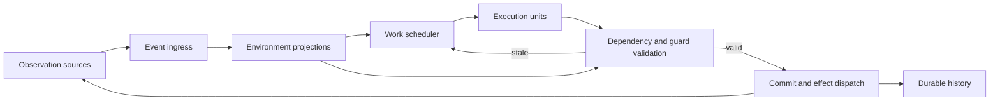

# Concurrent Agent Runtime

## Status

This document describes a target architecture for extending Canary from a
turn-oriented agent runtime into a runtime that can also operate in concurrent,
independently changing environments. It is a design direction, not a statement
that every type or API described here already exists.

## Motivation

The current Canary runtime fits a common digital-agent interaction:

```text
user input -> model -> function calls -> model -> final response
```

The thread is durable, one turn owns execution, and another request cannot
concurrently advance the same session. This is a useful consistency model for
chat, question answering, and many code-agent workflows because the relevant
environment is often stable while the model reasons.

A physical agent cannot make that assumption. Cameras, microphones, humans,
other machines, and physics continue changing the environment while models and
tools execute. A result produced from state `S` may arrive after the environment
has advanced to `S'`.

Concurrency is therefore part of the meaning of execution, rather than only a
performance optimization. The runtime must know what a computation depended
on, determine whether its result is still valid, and commit or discard it
accordingly.

This requirement is not limited to robots. Browsers, production services,
collaborative documents, and remote systems also evolve independently. A
single-channel, user-driven agent is the simplest case of this more general
model.

## Core Principle

The model is an execution unit; the agent runtime is the machine.

The runtime coordinates heterogeneous units with different latency and
frequency characteristics:

| Execution unit | Typical timescale | Role |
| --- | --- | --- |
| Safety controller | microseconds to milliseconds | Enforce hard invariants |
| Device controller | milliseconds | Stabilize and actuate |
| Perception pipeline | milliseconds | Produce observations |
| Local policy or VLA | tens of milliseconds | Reactive decisions |
| Interactive model | hundreds of milliseconds | Human interaction |
| Frontier model | seconds or longer | Planning and reasoning |
| Remote function | unpredictable | External knowledge or effects |

Canary does not need to implement every execution unit. It needs contracts that
allow applications to register, schedule, observe, cancel, and validate them.

## Runtime Shape



The logical execution path is:

```text
observe -> project -> issue -> execute -> validate -> commit
                                      \-> squash or replay
```

Execution can be concurrent and speculative. Commit remains explicit.

## Two Planes

The runtime separates durable agent state from rapidly changing live state.

### Durable control plane

The control plane records facts that must survive restart:

- goals and tasks
- accepted observations when durability is required
- issued work and its dependencies
- committed decisions and external effects
- suspensions, failures, cancellation, and recovery
- human interaction history

The existing append-only thread and turn-item model belongs primarily to this
plane. It remains useful as a factual journal and recovery source.

### Live execution plane

The execution plane coordinates current activity:

- high-rate observations
- in-memory projections and caches
- runnable and in-flight work
- priorities and scheduling classes
- dependency invalidation
- cancellation and replay
- connections to models, policies, functions, and controllers

Not every camera frame or controller tick should become a durable conversation
item. Applications decide which observations need persistence.

## Observations And Projections

An observation is a factual report from one source. It is not automatically a
globally consistent snapshot of the world.

Conceptually:

```rust
struct Observation {
    source: SourceId,
    sequence: u64,
    observed_at: Timestamp,
    payload: Value,
}
```

Each source owns its sequence. Timestamps help correlate data but do not create
a perfect global ordering. Causal relationships should be represented
explicitly when they matter.

Projections derive useful state from observations. A projection is a runtime
view or belief about the environment, not the physical world itself. It may be
partial, delayed, or uncertain.

## Work And Dependencies

A work item describes computation to be performed by an execution unit:

```rust
struct WorkItem {
    id: WorkId,
    execution_unit: ExecutionUnitId,
    dependencies: Vec<Dependency>,
    priority: Priority,
    validity: ValidityPolicy,
    payload: Value,
}
```

Dependencies identify the assumptions read by the work. They should be
semantic and fine-grained:

```text
human_intent @ version 7
object/cup/pose @ version 42
navigation/map @ version 12
```

A global environment revision is insufficient by itself. If an unrelated
camera region changes, a navigation plan should not necessarily be discarded.
Fine-grained dependencies let the runtime invalidate only affected work.

The application owns the meaning and versioning of dependency subjects. Canary
owns their transport, tracking, and validation lifecycle.

## Proposal, Validation, And Commit

An execution result is initially a proposal:

```rust
struct WorkResult {
    work_id: WorkId,
    based_on: Vec<Dependency>,
    proposal: Value,
}
```

Before retirement, the runtime checks the proposal against the current
projection and applicable guards. The result is one of:

- `Commit`: dependencies and guards remain valid
- `Revalidate`: the result may be repaired or checked against newer state
- `Squash`: the assumptions are invalid and the result must not commit
- `Replay`: issue replacement work against a newer projection

An environment change does not automatically invalidate all work. A result is
stale only when a relevant dependency or guard no longer holds.

Commit must be atomic from the agent-state perspective: the accepted result,
its dependency validation, state transition, and declared effect intent are
recorded together before downstream observers treat the work as complete.

## Effect Delivery Semantics

Both digital and physical actions can create irreversible external effects. A
database write, payment request, message publication, device command, spoken
response, and physical movement all require explicit execution semantics. The
distinction is not whether an action is digital or physical, but what guarantee
its executor can provide when delivery, execution, or acknowledgment fails.

Canary uses three delivery semantics for effectful work:

```rust
enum EffectDelivery {
    AtMostOnce,
    AtLeastOnce,
    ExactlyOnce,
}
```

| Semantic | Runtime behavior | Possible outcome |
| --- | --- | --- |
| `AtMostOnce` | Do not automatically retry an issued action after an ambiguous outcome | The effect occurs zero or one time |
| `AtLeastOnce` | Retry until the executor acknowledges completion or reconciliation terminates | The effect occurs one or more times |
| `ExactlyOnce` | Retry is allowed only through a protocol that deduplicates or atomically commits the effect | One externally committed effect |

`AtMostOnce` is appropriate for non-idempotent actions when duplication is more
dangerous than omission. If acknowledgment is lost, the result may remain
indeterminate and require reconciliation.

`AtLeastOnce` is appropriate when omission is unacceptable and duplicate
execution is either safe or handled by the target. It normally requires an
idempotent operation, a command ID, or application-level duplicate handling.

`ExactlyOnce` is an end-to-end capability, not a promise the runtime can create
by itself. It requires support from the effect adapter and target system, such
as durable command-ID deduplication or an atomic transaction that couples the
effect with its completion record. When that support is absent, the action must
use `AtMostOnce` or `AtLeastOnce` semantics instead.

Effectful proposals must pass dependency and safety validation before dispatch.
Their durable records should include the command identity, selected delivery
semantic, attempt state, acknowledgment, and reconciliation result. This lets
recovery distinguish work that was never issued from work whose external
outcome is unknown.

Delivery semantics and reversibility are separate properties. An exactly-once
effect may still be irreversible, while an at-least-once effect may have a
compensating action. Idempotency, deduplication, compensation, and transactional
support are capabilities declared by the application or effect adapter; Canary
must not infer them.

## Typical Cases

The following cases exercise the main correctness properties of the model
without requiring a particular scheduler implementation.

### Concurrent independent computation

Two work items execute at the same time and depend on unrelated state:

```text
Work A reads document/summary @ 4  -> Proposal A
Work B reads navigation/map @ 12  -> Proposal B
```

Neither dependency changes before validation. Both proposals can be accepted
and committed. Their completion order does not need to match their issue order
because they neither depend on nor conflict with each other.

This is the ordinary concurrency case: independent execution should not be
serialized merely to preserve a global turn order.

### Dependency invalidation

A work item plans from an observed version of a subject:

```text
Work A reads object/cup/pose @ 42
    -> environment advances object/cup/pose to 43
    -> Work A produces Proposal A
    -> validation rejects the stale dependency
```

The proposal must not commit against the new pose. Validation reports the
invalidation; a later policy decides whether to discard, revalidate, or reissue
the work against version 43. Unrelated environment changes would not invalidate
this proposal.

### Concurrent conflicting effects

Two proposals can both be fresh while competing for authority over the same
resource:

```text
Work A -> move robot/arm/right to shelf A
Work B -> move robot/arm/right to shelf B
```

Dependency validation alone cannot resolve this conflict. Both proposals need
an exclusive claim on `robot/arm/right`, and only the holder of the current
effect fence may dispatch a command. The other proposal must wait, be rejected,
or be reconsidered according to policy.

The same model applies to digital effects such as two valid proposals trying to
publish different revisions of the same document.

### Crash after effect dispatch

An accepted proposal produces a durable effect intent with command identity
`C`. The dispatcher sends `C`, but the runtime crashes before recording an
acknowledgment:

```text
effect intent C committed
    -> C dispatched
    -> runtime crashes
    -> acknowledgment unknown
    -> recovery finds unresolved C
    -> reconciliation determines the outcome
```

Recovery must not infer that the effect failed, succeeded, or was never issued.
The outcome is indeterminate until the executor or environment can reconcile
it. Whether `C` may be retried depends on its declared `AtMostOnce`,
`AtLeastOnce`, or `ExactlyOnce` semantics and on capabilities provided by the
effect adapter.

## Safety Boundary

Hard real-time control and safety enforcement remain outside the frontier-model
loop. A slow or unavailable model must not prevent stabilization, collision
avoidance, emergency stop, or other mandatory controls.

Canary may issue high-level intent to a controller and observe its progress,
but the controller owns its timing guarantees. Safety guards have authority to
reject, interrupt, or constrain work independently of model output.

## Scheduling

The scheduler coordinates heterogeneous work rather than simply iterating a
model/function loop. Useful scheduling inputs include:

- priority and preemption class
- dependencies and readiness
- execution-unit availability
- validity horizon
- cancellation state
- resource ownership
- safety and authorization guards

Scheduling policy is application-specific. Canary should define the lifecycle
and extension points without embedding robot, device, or business policy.

## CPU Analogy

The CPU analogy is useful for asking systems questions:

| CPU concept | Agent runtime concept |
| --- | --- |
| Instruction | Work item |
| Execution unit | Model, policy, function, or controller |
| Read set | Semantic dependencies |
| Instruction window | Runnable and in-flight work |
| Speculative result | Proposal |
| Reorder buffer | In-flight work registry |
| Retirement | Validated commit |
| Misprediction | Invalidated assumption |
| Pipeline squash | Cancellation or discard |
| Replay | Reissue against newer state |
| Exception | Safety, authorization, or validity failure |

The analogy has limits. The physical world is not transactional memory, there
may be no globally consistent snapshot, and external effects cannot always be
rolled back. Canary should adopt the useful execution semantics without trying
to imitate CPU machinery literally.

## Compatibility With The Turn Runtime

The current user-driven runtime remains expressible as a constrained profile:

```text
observation sources: one user-input channel
concurrent work: one active model/function chain
dependency scope: current thread projection
commit order: sequential
preemption: user cancellation
environment changes: primarily committed agent effects
```

A turn can be represented as a root work item whose child model and function
work is issued sequentially. Existing thread, turn, suspension, cancellation,
recovery, and revision-aware persistence semantics remain valid.

Compatibility does not require forcing high-rate physical observations into
turn items. The turn runtime should become an adapter or profile over the
general kernel, while preserving its existing application-facing behavior.

## Proposed Ownership Boundaries

The generalized kernel should own:

- immutable event and identifier types
- work lifecycle and legal state transitions
- dependency and guard references
- proposal and commit records
- cancellation, squash, and replay facts
- invariants required for deterministic recovery

The concurrent runtime should own:

- event ingestion
- projection orchestration
- scheduling and execution-unit dispatch
- in-flight work tracking
- validation before commit
- recovery and reconciliation orchestration

Applications should own:

- sensor and device adapters
- dependency subject semantics
- projection algorithms and world models
- scheduling priorities and resource policy
- safety rules and real-time controllers
- tool, skill, VLA, and model implementations
- decisions about which observations are durable

## Migration Direction

The architecture should evolve without replacing the current runtime in one
step:

1. Define observation, work, dependency, proposal, and commit semantics in the
   kernel.
2. Specify the work state machine and recovery invariants independently of any
   scheduler implementation.
3. Implement a concurrent runtime beside the existing turn runtime.
4. Express the turn loop as a single-channel scheduling profile or adapter.
5. Add heterogeneous execution units and fine-grained invalidation.
6. Add physical-world adapters only after the general contracts stabilize.

Each stage should retain deterministic factual history and avoid inferred state
in the journal.

## Out Of Scope

This architecture does not make Canary responsible for:

- robotics middleware or device drivers
- SLAM, perception, or world-model algorithms
- motor control or hard real-time scheduling
- application safety policy
- a universal ontology for environmental state
- automatic rollback of physical effects
- model training or reinforcement-learning weight updates
- globally ordering all physical observations

These systems can integrate with Canary through execution-unit, observation,
projection, validation, and effect boundaries.

## Open Design Questions

Before implementation, the following contracts require deeper design:

- the exact work-item state machine and terminal states
- how dependency versions are produced and compared
- whether validation is synchronous, asynchronous, or both
- how work is revalidated without full replay
- how resource ownership and effect fencing interact
- which events are durable and which remain live-only
- how scheduling profiles expose fairness and preemption
- how a turn maps onto the generalized work hierarchy
- how recovery handles effects whose outcome is indeterminate

The first implementation task should be the state machine and its invariants.
Scheduler and adapter APIs should follow from that model rather than precede it.
