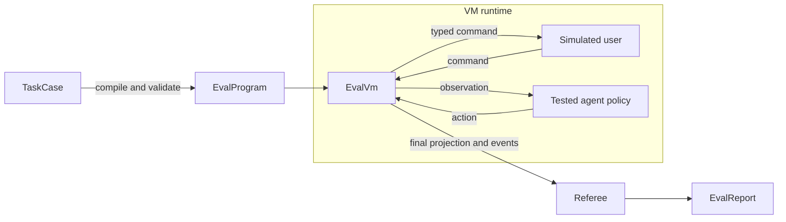
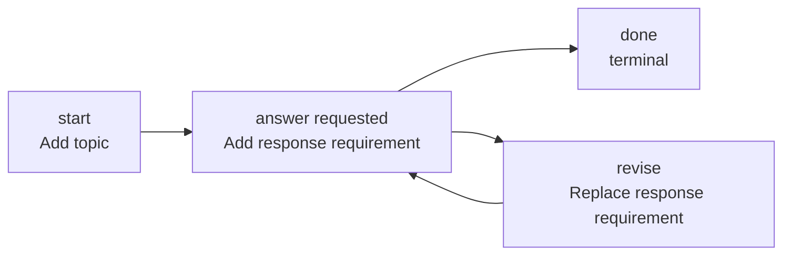
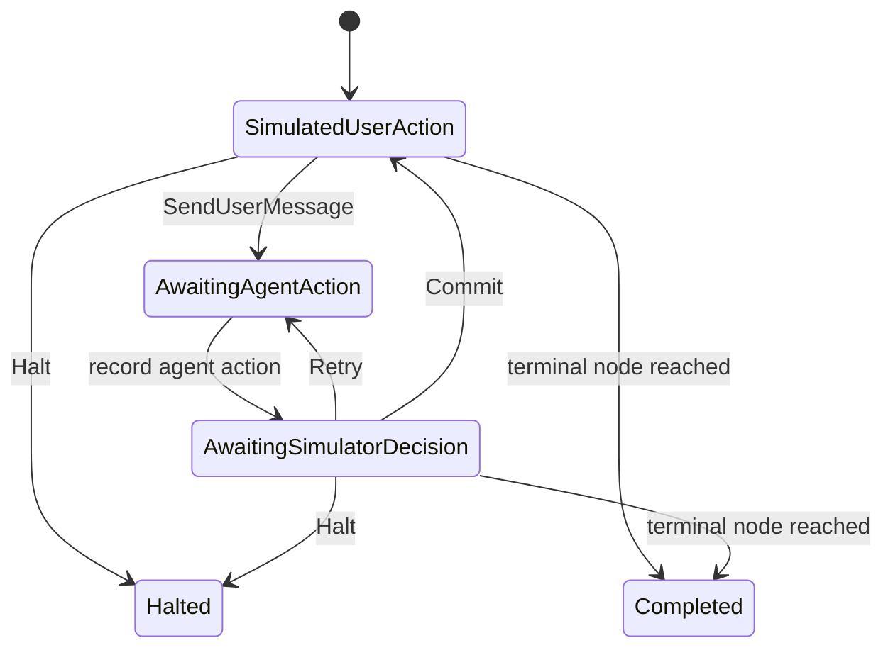
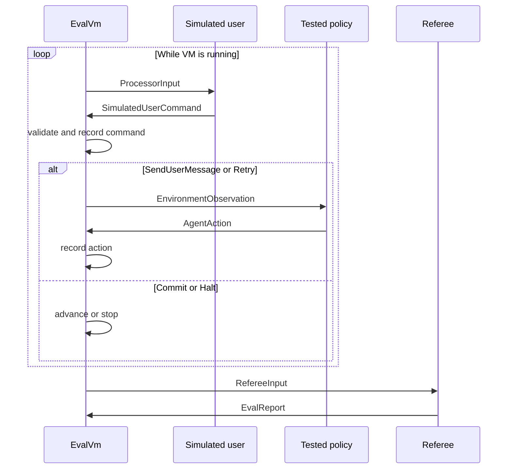

# Lite Agent Evaluation Framework

This document describes the evaluation framework in `lite-agent-eval`.
The framework is business agnostic: a host application defines the task case,
the constraints, the simulated-user policy, and the scoring metrics. The crate
provides the execution model that runs those pieces together.

The central idea is to treat an evaluation as a small program executed by a
virtual machine:

```text
authored task case -> compiled evaluation program -> VM execution -> report
```

The task case is the source artifact. The compiled program is immutable runtime
input. The VM owns the mutable execution state and factual trajectory.

## Mental Model

An evaluation has three kinds of participants:

1. **Tested agent**: the policy being evaluated. It receives environment
   observations and returns actions.
2. **Simulated user**: the controller of the task interaction. It examines the
   VM state and the latest tested-agent observation, then chooses the next
   command.
3. **Referee**: the evaluator of the completed trajectory. It produces a
   report and metrics.

The VM is the coordinator and authority. The simulated user does not mutate
the VM directly. It emits a typed command, and the VM validates and applies
that command.

The tested agent is the policy being evaluated. It does not own the evaluation
program, advance the task graph, or decide whether a transition is valid. It
consumes an `EnvironmentObservation` and returns an `AgentAction`. The VM
records that action and hands it back to the simulated user and, eventually,
the referee.



This gives the framework a useful separation of concerns:

- the case describes what the interaction should look like;
- the roles generate and judge runtime behavior;
- the VM enforces sequencing and transition invariants;
- the event history records what actually happened.

The tested agent is therefore inside the execution boundary as a policy, but
it is not part of the VM's state machine. The simulated user is the current
environment controller that chooses VM commands; the VM is the machine that
validates and applies them.

## Modeling A Task

### TaskCase

`TaskCase` is the authored form of an evaluation. It contains:

- a case ID and version;
- a start node;
- task nodes;
- transitions between nodes.

A node is a point in the task state machine. It can contain:

- constraint deltas;
- an optional result obligation;
- an optional evidence obligation;
- a terminal flag.

A transition has:

- an ID;
- source and destination nodes;
- a transition kind;

The graph is the authored interaction shape. For example:



The edge selected by the simulated user determines which node-local deltas
are applied next. Natural-language realization is produced by the simulated
user or a future observation realizer; it is not stored in the graph. A
revision or conflict-resolution edge is still an ordinary typed transition;
the framework does not assume that every path is a simple linear progression.

The transition kind is descriptive rather than business-specific:

- `Progress`: normal forward progress;
- `Revision`: a revised or corrected state;
- `BranchSelection`: selection among alternatives;
- `ConflictResolution`: movement after a conflict is addressed.

The framework does not interpret the payload of a constraint or obligation.
Those values are `serde_json::Value`, allowing a host to define its own domain
vocabulary.

### Constraints

Constraints accumulate along the path taken by the VM. Each node contributes
zero or more `ConstraintDelta` values when the node is entered.

The supported operations are:

- `Add`: introduce a new active constraint;
- `Replace`: remove one active constraint and introduce another;
- `Remove`: remove an active constraint.

Constraint IDs are globally validated when the case is compiled. This gives
the authored case a stable vocabulary for later replacement and removal.

The constraint state is represented by `ConstraintLedger`:

```text
active:  ConstraintId -> Value
applied: ordered list of ConstraintApplication
```

`active` is the current effective state. `applied` is the factual history of
constraint deltas that were accepted while entering nodes. The ledger is not a
semantic solver: two JSON values are not compared for domain compatibility by
the core.

The operations have precise state-machine behavior:

| Operation | Required state | Effect |
| --- | --- | --- |
| `Add` | ID is not active | Insert the new ID and value |
| `Replace` | Target ID is active | Remove the target, then insert the new ID and value |
| `Remove` | Target ID is active | Remove the target |

An invalid operation fails the VM transition. For example, adding an already
active ID or removing an inactive ID is not silently accepted.

`ActivationPolicy` describes how a constraint may become active:

- `ExplicitDisclosure`: requires an explicit user action;
- `AlreadyAuthorized`: existing facts may authorize it;
- `Derivable`: the domain may derive it from existing facts.

The framework does not decide whether a domain statement is semantically true.
It only applies the declared state transition and keeps the resulting ledger.

Activation policy also participates in epsilon-transition eligibility. A
transition may be delivered as `epsilon` only when all of the following hold:

1. the source node has exactly one outgoing transition;
2. the transition kind is `Progress`;
3. every constraint delta on the destination node is an `Add` whose activation
   policy is `AlreadyAuthorized` or `Derivable`.

Otherwise the simulated user must use an explicit transition delivery. This is
why epsilon behavior is a property of the graph and destination constraints,
not a flag chosen independently while authoring a test run.

### Compilation

`TaskCase::compile()` lowers vectors into indexed `BTreeMap` structures and
checks basic structural invariants:

- IDs are non-empty;
- node and transition IDs are unique;
- the start node exists;
- transitions reference existing nodes;
- replacement targets refer to declared constraint IDs.

The output is an immutable `EvalProgram`. Compilation is the boundary between
authored test data and executable evaluation data.

## VM State Machine

`EvalVm` owns the compiled program, an environment state, a runtime projection,
and the factual event history:

- the immutable `EvalProgram`;
- an `EvalState` containing latent constraints and visibility state;
- an `EvalProjection` describing control state and the public read model;
- an append-only in-memory list of `EvalEvent` values.

The environment state and the tested-policy observation are different things:

```text
latent EvalState
      | visibility rules
      v
EnvironmentObservation -> TestedPolicy -> AgentAction
```

The current implementation exposes only disclosed or derivable constraints in
the tested policy's environment observation. Explicitly disclosed constraints
remain latent until an environment-policy step marks them as disclosed. The
simulated-user processor receives a visibility-filtered projection; the
referee receives the complete projection.

The projection contains:

- VM status: `Running`, `Completed`, `Halted`, or `Failed`;
- execution phase;
- current node;
- an optional pending transition;
- the active constraint ledger;
- a monotonically increasing step number.

The phases are:



The implementation currently names `SimulatedUserAction` as
`EvalPhase::AwaitingUserAction` and the next phase as
`EvalPhase::AwaitingAgentAction`. The diagram uses semantic names because
the eval VM has no direct human-input phase: all user actions are generated by
the simulated-user component.

The VM exposes reducer-style operations for deterministic testing:

- `record_agent_action(action)` records an agent action in the expected phase;
- `apply_command(command)` validates and applies a simulated-user command.

In particular, `SendUserMessage` does not mean that a human is interacting
with the VM. It means that the simulated user has instructed the tested agent
to receive the next input.

Invalid phase transitions, unknown transitions, invalid pending transitions,
and invalid constraint operations return `EvalError` instead of mutating the
state as if the command succeeded.

## Role Components

The normal VM constructor receives an `EvalVmComponents` bundle:

```rust
let components = EvalVmComponents::new(
    tested_agent,
    simulated_user,
    referee,
);
let mut vm = EvalVm::new(program, components)?;
let report = vm.run().await?;
```

The components are trait-based:

```rust
pub trait TestedPolicy {
    fn act<'a>(&'a self, observation: EnvironmentObservation)
        -> RoleFuture<'a, AgentAction>;
}

pub trait SimulatedUserProcessor {
    fn decide<'a>(&'a self, input: ProcessorInput)
        -> RoleFuture<'a, SimulatedUserCommand>;
}

pub trait Referee {
    fn evaluate<'a>(&'a self, input: RefereeInput)
        -> RoleFuture<'a, EvalReport>;
}
```

The runtime adapter `RuntimeAgentIo` allows a normal `lite-agent-runtime::Agent`
to implement the role I/O contract. A host may also provide deterministic
mock implementations, a rules-based simulated user, or a custom referee.

For isolation, the recommended deployment shape is three agent instances:

```text
tested-agent instance
  business tools, for example web_search

simulated-user instance
  eval_command only

referee instance
  normally no tools
```

They may share the same model provider configuration and persistence root, but
their function registries should remain role-specific. This prevents the
tested agent from seeing evaluation-control functions.

## Evaluation Execution

`EvalVm::run()` performs the orchestration loop:

1. The simulated user receives a `ProcessorInput` containing the program,
   visibility-filtered projection, and latest agent action.
2. It returns a `SimulatedUserCommand`.
3. The VM applies and validates the command.
4. If the command sends or retries a user message, the tested agent executes
   that message.
5. The VM records the resulting `AgentAction`.
6. The loop continues until the VM reaches a terminal status.
7. The referee receives the final program, projection, and event history.
8. The VM returns the referee's `EvalReport`.



The simulated user is therefore the current environment controller that
advances the evaluation program. The VM is the execution container and state
authority. The tested agent is the policy under evaluation, and its action is
observed by the environment rather than treated as a direct VM command.

## Typed `eval_command`

The simulated user should control the VM through the `eval_command` function,
not by writing a JSON command in assistant text. `EvalCommandTool` lives in
this crate because it is part of the evaluation protocol rather than a
general-purpose business tool.

The tool accepts typed variants for:

- `send_user_message`;
- `retry`;
- `commit`;
- `halt`.

For example:

```json
{
  "kind": "commit",
  "transition": "finish",
  "delivery": "explicit",
  "evidence": [
    {
      "kind": "url",
      "reference": "https://example.com/source"
    }
  ],
  "reason": "The tested agent returned the required result."
}
```

The tool deserializes arguments into a typed request and places one command in
an `EvalCommandSink`. The VM later takes the command and remains responsible
for phase and transition validation. The sink rejects multiple commands in a
single simulated-user turn.

This boundary is important because model-generated assistant text is not a
reliable protocol channel. Function arguments give the runtime structured
data, validation errors, and a clear event trajectory.

## Referee And Metrics

The referee receives the complete factual trajectory through `RefereeInput`:

- the compiled program;
- the final projection;
- all `EvalEvent` values.

`EvalMetric` is the extension point for deterministic scoring. A metric returns
a `MetricResult` containing a name, score, optional pass/fail value, and opaque
details. `MetricReferee` runs a list of metrics and computes the average score
when at least one metric is registered.

A host can instead implement `Referee` with an LLM, a rules engine, or a
hybrid evaluator. The referee is intentionally broader than a single boolean
task-completed check: it can inspect trajectory quality, evidence, policy
adherence, latency, tool usage, or any domain-defined criterion.

## Example Layout

The repository example in `examples/eval` demonstrates the three-agent setup:

```text
tested agent       -> Exa web_search
simulated-user     -> eval_command
referee            -> no tools
```

LLM configuration is environment based:

```bash
export LITE_AGENT_MODEL=your-model
export LITE_AGENT_API_KEY=your-model-key
export LITE_AGENT_BASE_URL=https://api.openai.com/v1
export EXA_API_KEY=your-exa-key

cargo run -p lite-agent-eval-example
```

The example is deliberately small. Applications should provide their own
cases, role prompts or policies, tool registries, and metrics.

## Current Scope And Limitations

The current crate is a v1 execution core. It intentionally does not provide:

- durable persistence or replay of the eval VM itself;
- distributed evaluation scheduling;
- automatic graph search or path planning;
- semantic interpretation of constraint payloads;
- automatic evaluation of result or evidence obligations;
- a universal simulated-user policy;
- a universal referee metric set.

Those concerns belong to host applications or future crate layers. The current
stable boundary is the typed program, VM reducer, role traits, factual event
history, and typed evaluation command tool.

## Extension Points

The main extension points are:

- `TaskCase` construction for new evaluation programs;
- JSON constraint and obligation payloads for domain semantics;
- `TestedPolicy` for different tested-agent adapters;
- `SimulatedUserProcessor` for rules, LLMs, or hybrid controllers;
- `Referee` and `EvalMetric` for scoring;
- additional typed evaluation tools if future VM control operations are needed.

The design keeps business-specific behavior at the edges while keeping the
program execution and transition invariants in the VM.
